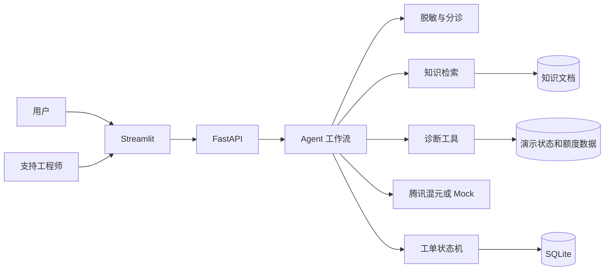

# 企业云产品智能支持与工单协同 Agent

这是一个面向企业云 AI 产品咨询、API 故障排查和人工工单协同的求职项目。用户提交问题后，系统会先脱敏，再进行意图分类和信息完整性检查；信息充分时检索知识库并调用诊断工具，证据不足或风险较高时创建人工工单。

项目使用虚拟产品 **CloudPilot AI** 和模拟账户数据。界面中的服务状态、账户额度和工单结果均属于演示环境，不代表腾讯云或其他真实平台状态。

## 核心演示

1. 知识问答：询问“API Key 应该放在哪里”，系统返回带来源的回答。
2. 工具诊断：提交“429、部分请求失败、demo-account”，系统查询错误码和模拟账户额度。
3. 人工升级：提交“生产环境刚刚所有请求 503”，系统创建 P1 工单并保留处理时间线。

## 系统架构



## 技术栈

- FastAPI、Pydantic、SQLAlchemy、SQLite
- LangGraph 可选编排层；核心工作流不依赖框架也能运行
- Chroma 可选向量存储；默认离线检索器保证演示稳定
- 腾讯混元 OpenAI 兼容接口；没有 Key 时自动使用 Mock
- Streamlit 演示界面
- pytest 和 42 条固定评测样例

腾讯混元的兼容接口可通过 OpenAI 风格的 `/chat/completions` 调用。本项目默认使用 TokenHub 中国大陆地址，也允许通过环境变量切换到已有混元兼容地址。配置前请以腾讯云当前文档为准：

- [腾讯混元 OpenAI 兼容接口](https://cloud.tencent.com/document/product/1729/111007)
- [TokenHub 语言模型调用概览](https://intl.cloud.tencent.com/zh/document/product/1300/80632)

## 本地启动

### 1. 创建环境

Windows PowerShell：

```powershell
python -m venv .venv
.\.venv\Scripts\Activate.ps1
python -m pip install -r requirements.txt
Copy-Item .env.example .env
```

默认 `LLM_PROVIDER=mock`，无需密钥即可运行。接入腾讯混元时修改 `.env`：

```text
LLM_PROVIDER=hunyuan
HUNYUAN_API_KEY=你的APIKey
HUNYUAN_BASE_URL=https://tokenhub.tencentcloudmaas.com/v1
HUNYUAN_MODEL=hy3
```

不要把 `.env` 或真实密钥提交到 Git。

### 2. 启动后端

```powershell
uvicorn app.main:app --reload
```

- API 文档：<http://127.0.0.1:8000/docs>
- 健康检查：<http://127.0.0.1:8000/health>

### 3. 启动界面

另开一个终端：

```powershell
streamlit run ui/streamlit_app.py
```

打开 <http://127.0.0.1:8501>。

### Docker

```powershell
docker compose up --build
```

## API 示例

```powershell
$body = @{
  session_id = "demo-001"
  message = "返回 429，部分请求失败，Request ID: req-429-001"
  account_id = "demo-account"
} | ConvertTo-Json

Invoke-RestMethod -Method Post `
  -Uri http://127.0.0.1:8000/api/v1/chat `
  -ContentType application/json `
  -Body $body
```

主要接口：

| 方法 | 路径 | 用途 |
|---|---|---|
| POST | `/api/v1/chat` | 推进 Agent 对话 |
| POST | `/api/v1/tickets` | 手工创建工单 |
| GET | `/api/v1/tickets` | 查询工单列表 |
| GET | `/api/v1/tickets/{ticket_id}` | 查询工单详情 |
| PATCH | `/api/v1/tickets/{ticket_id}/status` | 按状态机更新工单 |
| POST | `/api/v1/tickets/{ticket_id}/feedback` | 记录解决反馈 |
| GET | `/api/v1/tickets/{ticket_id}/timeline` | 查询审计时间线 |

## 测试与评测

```powershell
pytest --cov=app --cov-report=term-missing
python scripts/run_evaluation.py
python scripts/demo_scenarios.py
```

评测脚本读取 `data/evaluation_cases.json`，生成：

- `reports/evaluation_results.csv`：逐条预测结果；
- `reports/metrics.json`：可重复计算的指标；
- `reports/测试报告.md`：对结果、失败案例和限制的解释。

本地延迟只统计规则、检索和工具选择，不包含腾讯混元网络耗时。接入真实模型后，需要补充人工引用检查和 Token 用量。

当前基线：24 项自动化测试全部通过；42 条自建固定样例上的意图分类、Recall@3、追问、工具选择、升级与脱敏检查均为 100%。这是小规模开发测试集的流程验证结果，不是生产性能承诺，完整口径见测试报告。

## 正式交付物

- [系统架构图](docs/system_architecture.svg)
- [两页解决方案 DOCX](docs/deliverables/企业云产品智能支持与工单协同Agent_两页解决方案.docx) / [PDF](docs/deliverables/企业云产品智能支持与工单协同Agent_两页解决方案.pdf)
- [测试报告 DOCX](docs/deliverables/企业云产品智能支持与工单协同Agent_测试报告.docx) / [PDF](docs/deliverables/企业云产品智能支持与工单协同Agent_测试报告.pdf)
- [9 页项目汇报 PPT](docs/deliverables/企业云产品智能支持与工单协同Agent_项目汇报.pptx)
- [2–3 分钟中文旁白演示视频](docs/deliverables/企业云产品智能支持与工单协同Agent_演示视频.mp4)
- [面试讲解与 12 个追问](docs/面试讲解与问答.md)
- [简历描述与指标口径](docs/简历描述.md)

## 设计取舍

- 普通 Python 工作流保存核心业务逻辑，LangGraph 只负责可替换的编排层。
- 默认离线检索器避免首次启动下载大型模型；设置 `RETRIEVER_BACKEND=chroma` 后使用 Chroma 和确定性中文 n-gram 向量。
- 模型只负责理解与表达，错误码、额度、服务状态和工单流转由程序执行。
- 工单状态机拒绝非法跳转，解决后才允许标记为候选知识。
- 发现敏感信息、生产大面积异常或用户明确要求人工时，系统直接升级。

## 项目结构

```text
app/            FastAPI、Agent、RAG、工具与工单逻辑
ui/             Streamlit 用户端和工程师端
knowledge/      17 篇虚拟产品知识文档
data/           42 条评测样例与演示数据
tests/          单元和流程测试
reports/        指标与测试报告
docs/           架构图、解决方案、PPT、视频和面试材料
scripts/        评测、演示和制品生成脚本
```

## 安全边界

- 不连接真实云账户、CRM 或工单平台。
- 不把工具结果描述成真实腾讯云状态。
- 在日志、工单和模型调用前遮盖 API Key、SecretID、手机号和邮箱。
- 知识库使用自行编写的虚拟产品资料，不包含培训内部材料。
- 无可靠依据时拒绝下结论并转人工。

## 面试讲解

建议沿着五个问题展开：为什么需要这套系统、工作流如何分支、模型和程序如何分工、怎样评测、下一步如何接入真实企业系统。完整话术见 `docs/面试讲解与问答.md`。
