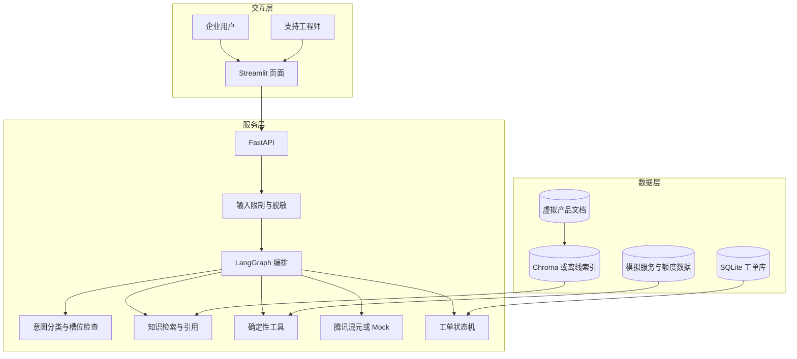

# 系统架构说明

## 核心边界

腾讯混元负责组织语言，知识检索提供依据，Python 工具返回确定性结果，工单状态机管理人工协同。任何工具查询都标注为演示环境。

## 组件关系

## 关键控制点

1. 输入在写入数据库和发送模型前脱敏。
2. 信息不完整时停止诊断并继续追问。
3. 工具结果由 Python 生成，模型不能伪造。
4. 无依据、数据安全、生产大面积异常和人工请求会触发升级。
5. 工单状态由固定状态机控制，非法跳转返回 409。

